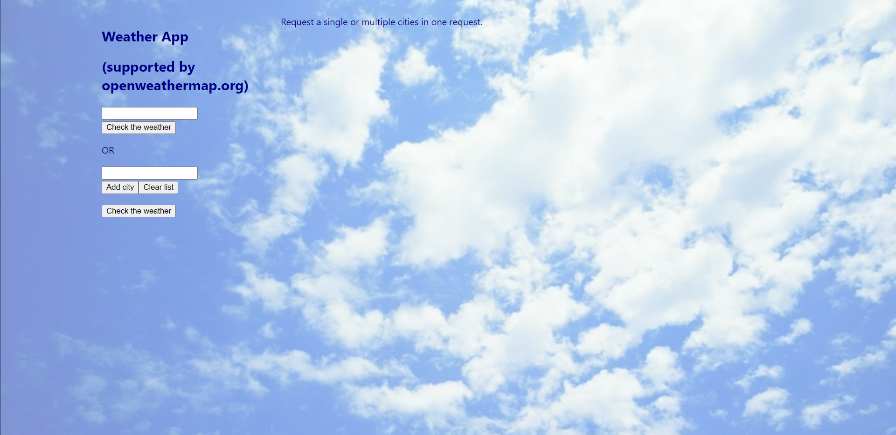
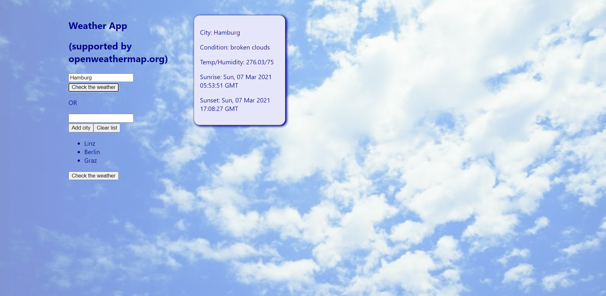
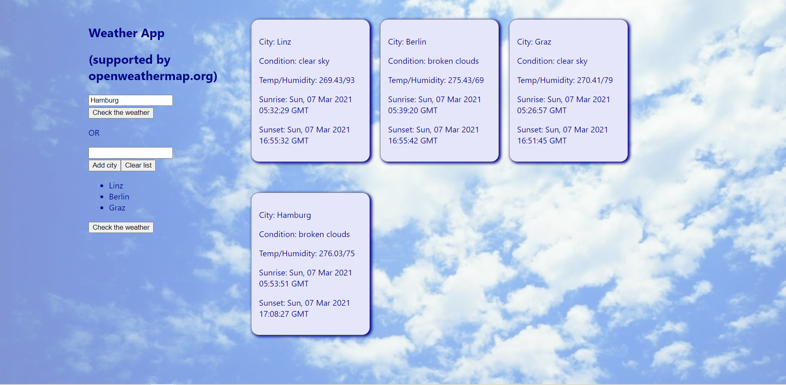

# React weather app

This weather app gives you the possibility of searching for one or more
multiple locations and their weather conditions.

 

This project was bootstrapped with [Create React App](https://github.com/facebook/create-react-app).

## Search for a single location

Simply enter the name of a location (english and german supported) and click on the "Check the weather" button.

If you entered a location that doesn't exist, the following error mesage will be shown in the bottom of the sidebar:

## Search multiple locations at once

You can define a list of locations, by adding cities to a list. By clicking on the "Check the weather" button below the list, all requested locations are shown in the current search. If you already searched for some other location, that will be shown below the current search result:

## Error handling

### Single locations

Only valid locations can be searched

### Multile locations

Only valid locations can be add to the location list.

 

Supported by openweathermap.org
